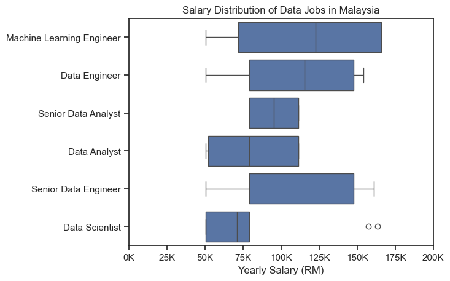
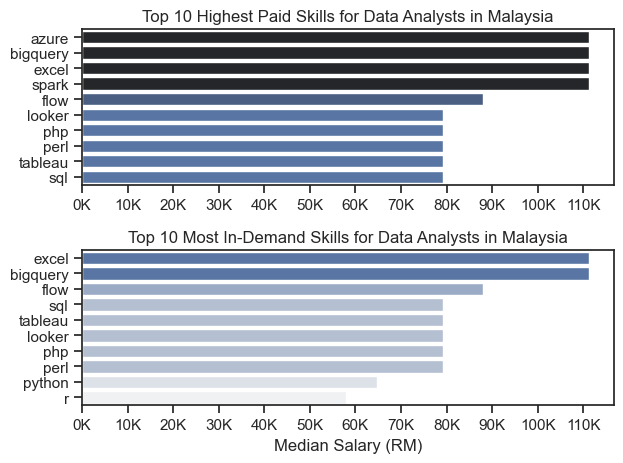
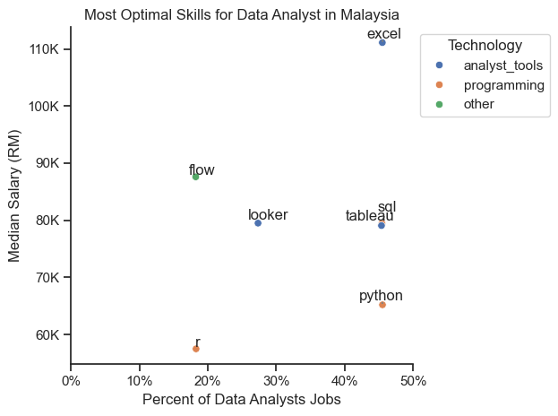

# Overview
Welcome to my analysis of the data job market, focusing on data analysts roles. This project was created out of a desire to navigate and understand the job market more effectively. It delves into the top-paying and in-demand skills to help find optimal job opportunities for data analysts.

The data sourced from [Luke Barousse's Datasets](https://huggingface.co/datasets/lukebarousse/data_jobs) which provides a foundation for my analysis, containing detailed information on job titles, salaries, locations and essential skills. The data are from 2023 and it might no longer be relevant or applicable in today's context due to changing trends, circumstances, and developments but it helped me to explore some key questions such as the most demanded skills, salary trends and the intersection of demand and salary in data analytics.

# The Questions
Below are the questions I want to answer in my project:

1. What are the skills most in-demand for the top 3 most popular data roles?
2. How are in-demand sils trending for Data Analysts?
3. How well do jobs and skills pay for Data Analysts?
4. What are the optimal skills for data analysts to learn? (High demand and High Paying)

# Tools I Used
For my deep dive into the data analyst job market, I harnessed the power of several key tools:

- **Python**: The backbone of my analysis. I also used the following Python libraries:
    - **Pandas Library :** This was used to analyze the data.
    - **Matplotlib Library:** I visualized the data.
    - **Seaborn Library:** Helped me to create more advanced visuals.

- **Jupyter Notebooks:** The tool I used to run my Python scripts which let me easily include my notes and analysis.
- **Visual Studio Code:** My go-to for executing my Python scripts.
- **Git & Github:** For sharing my Python code and analysis.

# Data Preparation and Cleanup
I start by importing necessary libraries and loading the dataset, followed by initial data cleaning tasks to ensure data quality.

```python 
# Importing libraries
import ast 
import pandas as pd
import seaborn as sns
from datasets import load_dataset 
import matplotlib.pyplot as plt 

# Loading Data 
dataset = load_dataset('lukebarousse/data_jobs')
df = dataset['train'].to_pandas()

# Data Cleanup
df['job_posted_date'] = pd.to_datetime(df['job_posted_date'])
df['job_skills'] = df['job_skills'].apply(lambda x: ast.literal_eval(x) if pd.notna(x) else x)
```
To focus my analysis on the Malaysia job market, I apply filters to the dataset, narrowing down to roles based in the Malaysia.
```python
df_MY = df[df['job_country'] == 'Malaysia']
```
# The Analysis
Each Jupyter notebook for this project aimed at investigating specific aspects of the data job market. Here’s how I approached each question:

## 1. What are the most demanded skills for the top 3 most popular data roles?
To find the most demanded skills for the top 3 most popular data roles. I filtered out those positions by which ones were the most popular, and got the top 5 skills for these top 3 roles. This query highlights the most popular job titles and their top skills, showing which skills I should pay attention to depending on the role I'm targeting.

View my notebook with detailed steps here: [2_Skill_Demand](./2_Skill_Demand.ipynb)

### Data Visualization 

```python
fig, ax = plt.subplots(len(job_titles), 1)

sns.set_theme(style="ticks")

for i, job_title in enumerate(job_titles):
    df_plot = df_skills_perc[df_skills_perc['job_title_short'] == job_title].head(5)
    sns.barplot(data=df_plot, x='skill_percent', y='job_skills', ax=ax[i], hue='skill_percent', palette='dark:b_r')
    ax[i].set_title(job_title)
    ax[i].set_ylabel('')
    ax[i].set_xlabel('')
    ax[i].set_xlim(0, 70)
    ax[i].legend().set_visible(False)

    for n, v in enumerate(df_plot['skill_percent']):
            ax[i].text(v + 1, n, f'{v:.0f}%', va='center')
    
    if i != len(job_titles) - 1:
        ax[i].set_xticks([])

fig.suptitle('Likelihood of Skills Requested in MY Job Postings', fontsize=15)
fig.tight_layout()
plt.show()
```
### Results
 
*Bar graph visualizing the salary for the top 3 data roles and their top 5 skills associated with each in Malaysia.*

### Insights

- Across Malaysian job postings, `SQL` is a crucial skill for Data Analysts (43%), Data Engineers (57%), and Data Scientists (45%). This reflects its universal importance for managing and querying data within Malaysia's diverse industries
- `Python` is heavily favored among Malaysian job postings for Data Engineers (47%) and Data Scientists (56%). Its prominence indicates the growing demand for advanced programming and analysis capabilities in Malaysia's expanding tech sector.
- For Malaysia-based Data Analysts, `Excel` is a key skill (40%), particularly for reporting and manipulating data. However, its demand diminishes in more technical roles like Data Engineers and Data Scientists, emphasizing its niche applicability in certain sectors.

## 2. How are in-demand skills trending for Data Analysts?
To find how skills are trending in 2023 for Data Analysts, I filtered data analyst positions and grouped the skills by the month of the job postings. This got me the top 5 skills of data analysts by month, showing how popular skills were throughout 2023.

View my notebook with detailed steps here: [3_Skills_Trend](3_Skill_Trend.ipynb)

### Data Visualization
```python
df_plot = df_DA_MY_percent.iloc[:, :5]

sns.lineplot(data=df_plot, dashes=False, palette='tab10')
sns.set_theme(style="ticks")
sns.despine()

plt.title('Trending Top Skills for Data Analysts in Malaysia')
plt.ylabel('Likelihood in Job Posting')
plt.xlabel('2023')
plt.legend().remove()
plt.grid(visible=True, which='both', axis='both', linestyle='--', linewidth=0.5, alpha=0.7)


from matplotlib.ticker import PercentFormatter
ax = plt.gca()
ax.yaxis.set_major_formatter(PercentFormatter(decimals=0))

for i in range(5):
    if i == 2:  # Adjust the 3rd word
        plt.text(11, df_plot.iloc[-1, i] + 1, df_plot.columns[i]) 
    elif i == 3:  # Adjust the 4th word
        plt.text(11, df_plot.iloc[-1, i] - 1, df_plot.columns[i])
    else:
        plt.text(11, df_plot.iloc[-1, i], df_plot.columns[i])
```
### Results
 
*Bar graph visualizing the trending top skills for data analysts in Malaysia in 2023.*

### Insights

- `SQL` consistently ranks as the most sought-after skill throughout 2023, peaking at about 50% in May. `Excel` is a close second, reaching its highest demand in March (approximately 45%). Both skills maintain a strong presence across the year, highlighting their enduring importance in the Malaysian job market.
- `Python`** demand fluctuates, peaking at around 35% in July, indicating its increased value during mid-year hiring trends. `Tableau` similarly experiences variability, with a noticeable rise in demand in October (around 30%). This suggests these skills are valued for specific roles or projects at certain times of the year.
- While `Power BI` consistently exhibits the lowest demand among the five skills, ranging between 20% and 25%, it shows a slight upward trend towards the end of the year, peaking at 25% in December. This could imply a growing awareness or adoption of `Power BI` tools in Malaysia's data-driven industries.

## 3. How well do jobs and skills pay for Data Analysts?
To identify the highest-paying roles and skills, I only got jobs in the United States and looked at their median salary. But first I looked at the salary distributions of common data jobs like Data Scientist, Data Engineer, and Data Analyst, to get an idea of which jobs are paid the most.

View my notebook with detailed steps here: [4_Salary_Analysis](4_Salary_Analysis.ipynb)

### Data Visualization
``` python
sns.boxplot(data=df_MY_top6, x='salary_year_avg', y='job_title_short', order=job_order)

plt.title('Salary Distribution in Malaysia')
plt.xlabel('Yearly Salary (RM)')
plt.ylabel('')

ax = plt.gca()
ax.xaxis.set_major_formatter(plt.FuncFormatter(lambda x, pos: f'{int(x/1000)}K'))

plt.xlim(0, 200000)
plt.show()
```
### Results
 
*Box plot visualizing the salary distributions for the top 6 data job titles in Malaysia.*

### Insights 

- In Malaysia’s tech landscape, Machine Learning Engineers boast the highest earning potential. The boxplot indicates a higher median salary (around RM125K) with a wide spread, suggesting that advanced expertise in machine learning is both rare and highly rewarded, reflecting the competitive nature of Malaysia’s emerging AI and data-driven industries.
- For Data Scientists in Malaysia, the median salary sits around RM60K. However, the presence of significant outliers—extending as high as RM150K or more—reveals that while many roles offer moderate compensation, exceptional talent or specialized positions can break into the upper echelon. This dynamic hints at a market where exceptional skill or niche expertise can lead to much higher rewards.
- The boxplot displays a broad salary range for Senior Data Engineers in Malaysia, with a median near RM100K. This variability underscores how factors like industry sector, specialized skills, and individual experience contribute to considerable differences in compensation, emphasizing that in Malaysia, senior roles are influenced by diverse market forces.

### Highest Paid & Most Demanded Skills for Data Analysts

Next, I narrowed my analysis and focused only on data analyst roles. I looked at the highest-paid skills and the most in-demand skills. I used two bar charts to showcase these.

### Data Visualization 

```python
fig, ax = plt.subplots(2, 1)

sns.set_theme(style="ticks")

sns.barplot(data=df_DA_top_pay, x='median', y=df_DA_top_pay.index, ax=ax[0], hue='median', palette='dark:b_r')
ax[0].legend().remove()

ax[0].set_title('Top 10 Highest Paid Skills for Data Analysts in Malaysia')
ax[0].set_ylabel('')
ax[0].set_xlabel('')
ax[0].set_xticks(range(0, 110001, 10000))
ax[0].xaxis.set_major_formatter(plt.FuncFormatter(lambda x, pos: f'{int(x/1000)}K'))

sns.barplot(data=df_DA_skills, x='median', y=df_DA_skills.index, ax=ax[1], hue='median', palette='light:b')
ax[1].legend().remove()

ax[1].set_title('Top 10 Most In-Demand Skills for Data Analysts in Malaysia')
ax[1].set_ylabel('')
ax[1].set_xlabel('Median Salary (RM)')
ax[1].set_xlim(ax[0].get_xlim())
ax[1].set_xticks(range(0, 110001, 10000))
ax[1].xaxis.set_major_formatter(plt.FuncFormatter(lambda x, pos: f'{int(x/1000)}K'))

fig.tight_layout()
```
### Results 

*Separate bar graphs visualizing the highest paid skills and most in-demand skills for data analysts in Malaysia.*

### Insights

- In Malaysia, `Excel` stands out by appearing on both charts—ranking as a premium, well-compensated skill as well as the most in-demand. This dual presence underscores its necessity in daily data operations, from manipulation to reporting. For Malaysian data analysts, mastering `Excel` is fundamental to meeting industry demands and unlocking better salary opportunities.
- `BigQuery` is another skill that consistently ranks high in both salary and demand metrics in the Malaysian market. Its strong performance signifies the increasing reliance on cloud-based data solutions in Malaysia. Data professionals who enhance their expertise in `BigQuery` can expect not only competitive salaries but also a robust stream of job opportunities as organizations modernize their data infrastructures.
- Both `Flow` and `Looker` feature in the highest paid and most in-demand lists, reflecting their emerging status in Malaysia’s evolving data landscape. Their growing adoption signals that Malaysian organizations are investing in newer, more efficient data tools. For data analysts, developing proficiency in these modern technologies can provide a competitive edge, positioning them for roles in innovative and future-focused environments.

## 4. What are the most optimal skills to learn for Data Analysts?

To identify the most optimal skills to learn ( the ones that are the highest paid and highest in demand) I calculated the percent of skill demand and the median salary of these skills. To easily identify which are the most optimal skills to learn.

View my notebook with detailed steps here: [5_Optimal_Skills](5_Optimal_Skills.ipynb)

### Data Visualization 
```python
from adjustText import adjust_text

sns.scatterplot(
    data=df_plot,
    x='skill_percent',
    y='median_salary',
    hue='technology'
)
sns.despine()
sns.set_theme(style="ticks")

# Prepare texts for adjustText
texts = []
for i, txt in enumerate(df_DA_skills_high_demand.index):
    texts.append(plt.text(df_DA_skills_high_demand['skill_percent'].iloc[i], df_DA_skills_high_demand['median_salary'].iloc[i], txt))

# Adjust text to avoid overlap
adjust_text(texts, arrowprops=dict(arrowstyle="->", color='gray'))

# Set axis, labels and legend
plt.title('Most Optimal Skills for Data Analyst in Malaysia')
plt.xlabel('Percent of Data Analysts Jobs')
plt.ylabel('Median Salary (RM)')
plt.legend(loc='upper left', bbox_to_anchor=(1, 1), title='Technology')

from matplotlib.ticker import PercentFormatter
ax = plt.gca()
ax.yaxis.set_major_formatter(plt.FuncFormatter(lambda y, pos: f'{int(y/1000)}K'))
ax.xaxis.set_major_formatter(PercentFormatter(decimals=0))
ax.set_xlim(0, 50)

# Adjust layout and display plot
plt.tight_layout()
plt.show()
```

### Results

*A scatter plot visualizing the most optimal skills (high paying & high demand) for data analysts in Malaysia with color labels for technology.*

### Insights

- `Excel` (blue) stands out by achieving the highest median salary of around RM110K while being required in roughly 45% of data analyst job postings. This indicates that mastering `Excel` is indispensable in Malaysia’s data analyst landscape, as advanced `Excel` skills are highly rewarded and remain essential for roles that demand rigorous data manipulation and reporting.
- The scatter plot clearly differentiates between blue-coded analyst tools and orange-coded programming languages. Analyst tools such as `SQL`, `Tableau`, and `Looker` show median salaries between RM80K and RM90K, supporting their role as specialized, value-adding skills. In contrast, programming languages like `Python` and `R`—despite their high demand (e.g., `Python` appears in 45% of listings)—have a median salary closer to RM60K. This suggests that while programming skills are fundamental and widely expected, they are often viewed as foundational, with the salary premium belonging to more specialized analyst tools.
- The green-coded skill,`Flow` clusters around a median salary of RM80K but is featured in only about 20% of job listings. Although less common, this indicates that proficiency in niche or emerging tools such as`Flow`can differentiate candidates. In roles where these specialized skill sets are valued, they provide an opportunity to command competitive salaries, even if their general market demand is lower.


# What I Learned
Throughout this project, I deepened my understanding of the data analyst job market and enhanced my technical skills in Python, especially in data manipulation and visualization. Here are a few specific things I learned:
- **Advanced Python Usage:** Utilizing libraries such as Pandas for data manipulation, Seaborn and Matplotlib for data visualization, and other libraries helped me perform complex data analysis tasks more efficiently.
- **Data Cleaning Importance:** I learned that thorough data cleaning and preparation are crucial before any analysis can be conducted, ensuring the accuracy of insights derived from the data
- **Strategic Skill Analysis:** The project emphasized the importance of aligning one's skills with market demand. Understanding the relationship between skill demand, salary, and job availability allows for more strategic career planning in the tech industry.

# Insights 

This project provided several general insights into the data job market for analysts:

- **Skill Demand and Salary Correlation:** There is a clear correlation between the demand for specific skills and the salaries these skills command. Advanced and specialized skills like Python and Oracle often lead to higher salaries.
- **Market Trends:** There are changing trends in skill demand, highlighting the dynamic nature of the data job market. Keeping up with these trends is essential for career growth in data analytics.
- **Economic Value of Skills:** Understanding which skills are both in-demand and well-compensated can guide data analysts in prioritizing learning to maximize their economic returns.

# Challenges I Faced

This project was not without its challenges, but it provided good learning opportunities:

- **Data Inconsistencies:** Handling missing or inconsistent data entries requires careful consideration and thorough data-cleaning techniques to ensure the integrity of the analysis.
- **Complex Data Visualization:** Designing effective visual representations of complex datasets was challenging but critical for conveying insights clearly and compellingly.
- **Balancing Breadth and Depth:** Deciding how deeply to dive into each analysis while maintaining a broad overview of the data landscape required constant balancing to ensure comprehensive coverage without getting lost in details.

# Conclusion

This exploration into the data analyst job market has been incredibly informative, highlighting the critical skills and trends that shape this evolving field. The insights I got enhance my understanding and provide actionable guidance for anyone looking to advance their career in data analytics. As the market continues to change, ongoing analysis will be essential to stay ahead in data analytics. This project is a good foundation for future explorations and underscores the importance of continuous learning and adaptation in the data field.
